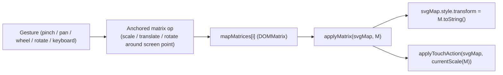

## Why the refactor

Today the transform stack is split across two elements:

- Wrapper (`#groundd` etc., a.k.a. `map0..map3`) gets `transform: rotate(θ)` with default `transform-origin: 50% 50%`.
- SVG inside gets `transform: translate(...) scale(...)` with `transform-origin: 0% 0%`.

`setTransform` (lines 59-88) and `rotateDeg` (lines 136-148) try to hand-compensate by rotating the translate vector and swapping `pointXX`/`pointYY` on rotation. The zoom-anchor formula in `zoomTowardClientPoint`:

```40:44:android/app/src/main/assets/engine/assets/js/Zoom.js
  const xs = (clientX - pointXX) / scaless;
  const ys = (clientY - pointYY) / scaless;
  mapScaleCache[maps_no][2] = scaless = s;
  mapScaleCache[maps_no][3] = pointXXOld = pointXX = clientX - xs * scaless;
  mapScaleCache[maps_no][4] = pointYYOld = pointYY = clientY - ys * scaless;
```

implicitly assumes the SVG's screen displacement equals `(pointXX, pointYY)`. With wrapper rotation that is actually `R·(pointXX, pointYY) + (O_w − R·O_w)`, where `O_w` is the wrapper center. The missing `O_w − R·O_w` term is exactly what makes pinch zoom anchor on the wrong side after rotating the map.

A unified per-map `DOMMatrix` written directly on the SVG removes the entire offset-compensation problem.

## Architecture after the refactor



- One `DOMMatrix` per map (`mapMatrices[0..3]`), default identity.
- Wrapper transform is never set (rotation moves to the SVG matrix). `rotater()` is removed.
- SVG keeps `transform-origin: 0 0` (already set in [maps.html](android/app/src/main/assets/engine/maps.html) line 141).

## Changes to [android/app/src/main/assets/engine/assets/js/Zoom.js](android/app/src/main/assets/engine/assets/js/Zoom.js)

### 1. Replace state

Remove: `mapRotateCache`, `mapScaleCache`, `scaless`, `pointXX`, `pointYY`, `pointXXOld`, `pointYYOld`, and `switchMapScaleCache`.

Add:

```javascript
let mapMatrices = [
  new DOMMatrix(),
  new DOMMatrix(),
  new DOMMatrix(),
  new DOMMatrix(),
];
```

### 2. New core helpers

Replace `setTransform` and `applyTouchAction` glue with:

```javascript
function currentScale(M) {
  return Math.hypot(M.a, M.b); // robust under rotation
}

function applyMatrix(svgMap, maps_no, M) {
  mapMatrices[maps_no] = M;
  const isIdentity = M.isIdentity;
  svgMap.style.transition = isIdentity ? 'transform 0.5s' : '';
  svgMap.style.transform = M.toString(); // matrix(a,b,c,d,e,f)
  applyTouchAction(svgMap, currentScale(M));
}

function localPoint(svgMap, clientX, clientY) {
  // SVG transform space == wrapper's content-box space (wrapper not rotated).
  const r = svgMap.parentElement.getBoundingClientRect();
  return { x: clientX - r.left, y: clientY - r.top };
}
```

### 3. Anchored gesture primitives

```javascript
function zoomAround(svgMap, maps_no, clientX, clientY, factor) {
  const M = mapMatrices[maps_no];
  const cur = currentScale(M);
  let next = cur * factor;
  if (next <= MIN_SCALE) {
    // Snap to no-zoom + recenter (preserves current UX of "fully zoomed out -> reset")
    applyMatrix(svgMap, maps_no, new DOMMatrix());
    return;
  }
  if (next > MAX_SCALE) factor = MAX_SCALE / cur;
  const p = localPoint(svgMap, clientX, clientY);
  const Mnew = new DOMMatrix()
    .translateSelf(p.x, p.y)
    .scaleSelf(factor)
    .translateSelf(-p.x, -p.y)
    .multiplySelf(M);
  applyMatrix(svgMap, maps_no, Mnew);
}

function panBy(svgMap, maps_no, dx, dy) {
  const Mnew = new DOMMatrix().translateSelf(dx, dy).multiplySelf(mapMatrices[maps_no]);
  applyMatrix(svgMap, maps_no, Mnew);
}

function rotateAround(svgMap, maps_no, deltaDeg, clientX, clientY) {
  const p = localPoint(svgMap, clientX, clientY);
  const Mnew = new DOMMatrix()
    .translateSelf(p.x, p.y)
    .rotateSelf(deltaDeg)
    .translateSelf(-p.x, -p.y)
    .multiplySelf(mapMatrices[maps_no]);
  applyMatrix(svgMap, maps_no, Mnew);
}
```

### 4. Rewire callers

- `zoomTowardClientPoint(svgMap, maps_no, cx, cy, nextScale)` becomes:
  ```javascript
  zoomAround(svgMap, maps_no, cx, cy, nextScale / currentScale(mapMatrices[maps_no]));
  ```
  (kept as a thin wrapper because both the wheel handler and keyboard zoom call it).
- Wheel handler (lines 283-298): unchanged in shape; `nextScale = scaless * zoomFactor` becomes computed off `currentScale(mapMatrices[maps_no])`. The `scaless <= MIN_SCALE && !ctrl/meta` page-scroll passthrough still applies (replace `scaless` reads with `currentScale(mapMatrices[maps_no])`).
- Keyboard `+`/`-` (lines 181-186): use SVG center as anchor (`getBoundingClientRect` mid-point) and call `zoomAround` with `KEYBOARD_ZOOM_STEP` or its reciprocal.
- Keyboard `0` (lines 187-197): `applyMatrix(svgMap, m, new DOMMatrix())`.
- Two-finger pinch branch in `onpointermove` (lines 300-322): unchanged shape, but pass `factor = curDiff / prevDiff` to `zoomAround` (no more separate `nextScale = scaless * ratio` math).
- Single-finger pan branch (lines 324-334): switch to incremental delta. On `onpointerdown` cache `lastX = e.clientX, lastY = e.clientY`. On move, compute `dx = ev.clientX - lastX, dy = ev.clientY - lastY`, call `panBy(svgMap, maps_no, dx, dy)`, then update `lastX/lastY`. The "pan only when zoomed or mouse" gate stays (`currentScale(M) > MIN_SCALE || pointerType === 'mouse'`).

### 5. Rotation buttons

Replace `rotateDeg` and `rotater` with a single helper invocation from the click handlers:

```javascript
document.getElementById('counterclock').onclick = () => {
  const m = parseInt(map_no);
  const svgMap = svgMaps[m];
  const r = svgMap.getBoundingClientRect();
  rotateAround(svgMap, m, -90, r.left + r.width / 2, r.top + r.height / 2);
};

document.getElementById('clock').onclick = () => {
  const m = parseInt(map_no);
  const svgMap = svgMaps[m];
  const r = svgMap.getBoundingClientRect();
  rotateAround(svgMap, m, 90, r.left + r.width / 2, r.top + r.height / 2);
};
```

The buttons live in the new `.map-controls` row I just added; their ids (`counterclock`, `clock`) are unchanged so this still binds correctly. `rotater()` and the wrapper-rotation code path are deleted entirely. As a one-time safety, in `reloades` clear any leftover wrapper transform: `svgMap.parentElement.style.transform = ''`.

### 6. Exports kept stable for [android/app/src/main/assets/engine/assets/js/Engine.js](android/app/src/main/assets/engine/assets/js/Engine.js)

`Engine.js` imports `switchMap`, `resetCache`, `switching` (line 1). All three remain exported:

- `switchMap()` — unchanged: still calls `attachKeyboardZoomOnce()` and `reloades(svgMaps[i], i)` for each map.
- `resetCache()` — resets each `mapMatrices[i] = new DOMMatrix()` and calls `applyMatrix` for all four SVGs.
- `switching(maps_no)` — becomes a no-op (no globals to swap; each map owns its matrix). Kept exported so `Engine.js` line 143 still works.

### 7. Touch-action behavior preserved

`applyTouchAction(svgMap, scale)` keeps its current rule (`'none'` if `scale > MIN_SCALE`, else `'pan-y'`) and is now driven from `applyMatrix`, so it stays correct after every gesture, rotate, or reset.

## Out of scope

- No HTML changes. The rotate-button row I just moved above the SVG stays as is.
- No CSS changes. `transform-origin: 0 0` on the SVG (already present in [maps.html](android/app/src/main/assets/engine/maps.html) line 141) is what we need.
- `Engine.js` is untouched. The exported function names and signatures don't change.

## Validation steps (manual, after edits)

1. At rotation 0: pinch over any spot of the SVG → SVG zooms anchored on the gesture center. Pinch in past 1.0 snaps to no-zoom and recenters.
2. Tap the clockwise (or counter-clockwise) rotate button: SVG rotates 90deg around its visible center, no jump.
3. After rotating 90 / 180 / 270: pinch over any spot of the SVG → zoom anchors at the gesture center (the original bug); fingers spreading toward the right zooms toward the right.
4. After rotating, drag with one finger while zoomed: pan tracks finger direction in screen space (not in pre-rotation map space).
5. While zoomed in: page does not scroll on vertical drag; at scale 1: page scrolls (preserves the earlier `touch-action` fix).
6. Press `0` (or hit Reset button if wired): matrix returns to identity, transition animates back smoothly.
7. Switch between Ground / First / Second / Backside floors: each floor remembers its own zoom + rotation independently.